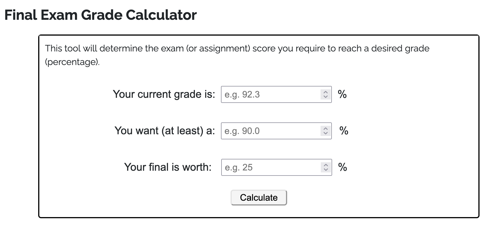
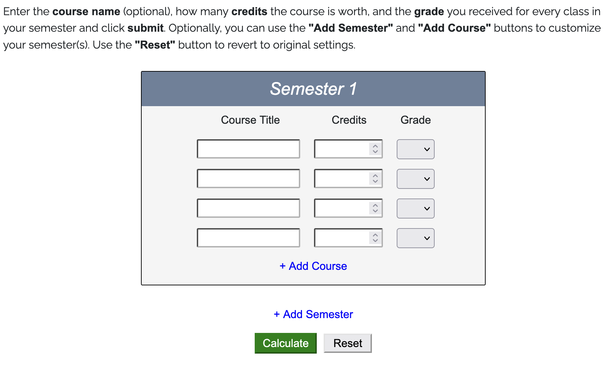
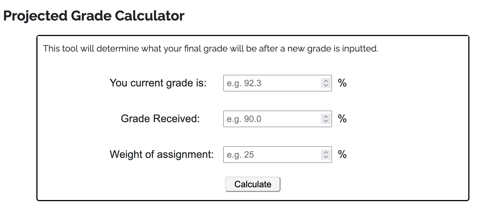

# CollegeCalc 

CollegeCalc is a college assistance tool designed for students seeking insight on their grades/academic standing.

## Description

CollegeCalc currently features 3 different types of tools; \
    - Final Exam Grade Calculator \
    - Projected Grade Calculator \
    - GPA Calculator  

Many students find themselves stressing about what they score they must achieve on an exam or assignment or what their GPA for the semester may be, and this is the website to go to.

## Usage


Input your current grade in the class, the grade you wish to achieve, and the weight of your exam (is the exam worth 15%, 20%, 50% of your grade), and the calculator will output the grade you must score on the final to achieve the grade you desire.


Input the course title (optional), the credits the course is worth, and the grade you achieved in that class. Do this for as many courses as you wish, and if you wish to add a course or add an entire semester, use the buttons below the semester table. Hit the reset button if you'd like to start from scratch again.


Input your current grade in the class, the grade you received (or think you'll receive) on the assignment, and the weight of the assignment (is the assignment worth 15%, 20%, 50% of your grade), and the calculator will display your new grade after that assignment is logged into your gradebook.

## Tech Stack
    - Frontend: HTML, CSS, Animate.css, Chart.js
    - Backend: JavaScript, Vue.js
    - API: Department of Education College Scorecard API

## Installation 

Clone the repository:
```bash
git clone https://github.com/ramiwalid/CollegeCalc
cd CollegeCalc
open home.html

